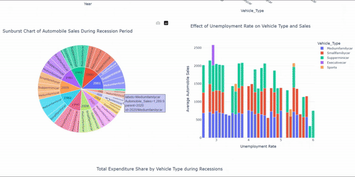
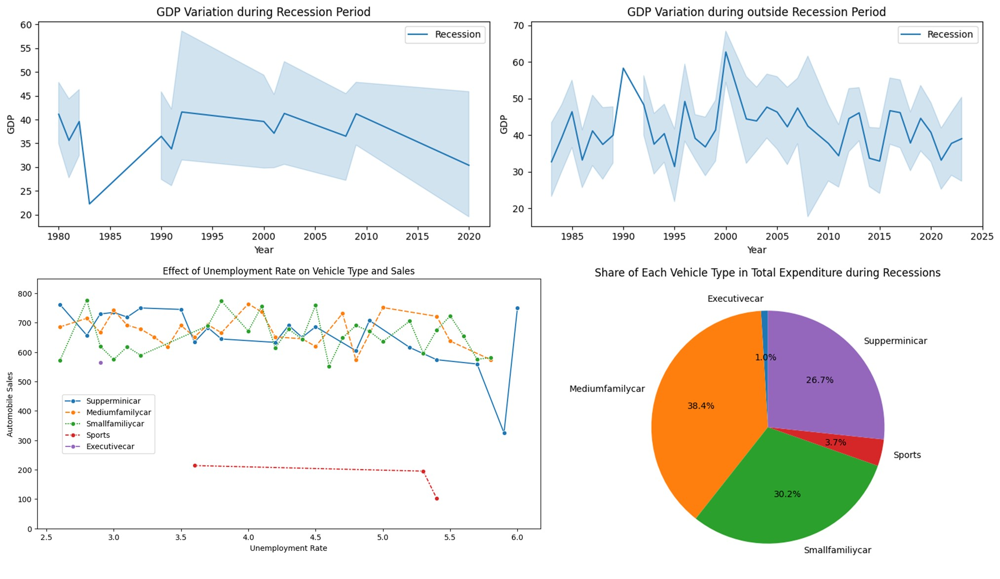
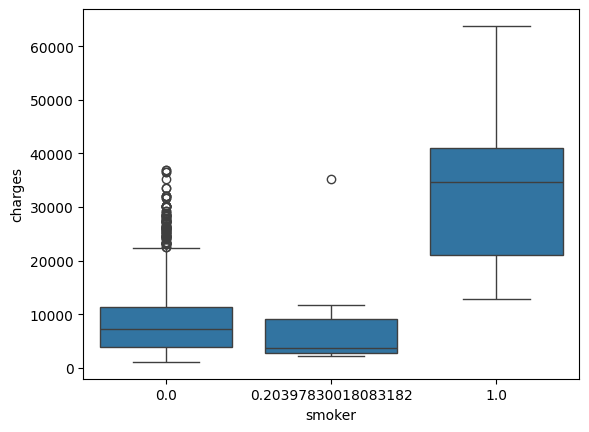
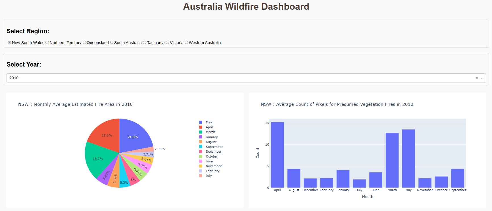

# Data Analysis Projects

This repository contains various data analysis projects encompassing exploratory data analysis (EDA), data wrangling, statistical analysis, and data visualization techniques. Below are the key projects included in this repository.

## Projects

### 1. Historical Automobile Sales
**Description:** Analysis of historical automobile sales. This project includes a detailed analysis of car sales during different periods, including recession periods. It uses data visualization techniques to present annual and recession period statistics.

**Technologies:** Python, Pandas, Plotly, Dash

**Main File:** [Historical_Automobile_Sales_Analysis.ipynb](Historical_Automobile_Sales_Analysis.ipynb)

**Dashboard:** [Automobile_Sales_Dashboard.py](Automobile_Sales_Dashboard.py)

### 2. House Sales in King County, USA
**Description:** Analysis of house sales in King County, USA. This project focuses on interpreting property sales data, providing a detailed analysis of the real estate market in this region.

**Technologies:** Python, Pandas, SQL

**Main File:** [House_Sales_King_County.ipynb](House_Sales_King_County.ipynb)

### 3. Insurance Cost Analysis
**Description:** Analysis of insurance costs. This project analyzes the factors affecting insurance costs using various statistical and data visualization techniques.

**Technologies:** Python, Pandas, Seaborn

**Main File:** [Insurance_Cost_Analysis.ipynb](Insurance_Cost_Analysis.ipynb)

### 4. Wildfire Dashboard with Python
**Description:** Interactive dashboard for visualizing wildfires in Australia. It uses historical data to display the estimated fire area and the number of vegetation fire pixels by month and region.

**Technologies:** Python, Pandas, Dash, Plotly

**Main File:** [Autralia_wildfire_Dashboard.py](Autralia_wildfire_Dashboard.py)

### 5. Power BI Projects
- **Real Estate Analysis**: This project involves an in-depth analysis of real estate data using Power BI, providing insights into market trends and property performance.
  - **Main File:** [Power BI/01_Inmuebles.pbix](Power%20BI/01_Inmuebles.pbix)

- **Sales Performance Analysis**: A detailed examination of sales performance metrics, utilizing Power BI to visualize and analyze sales data effectively.
  - **Main File:** [Power BI/02_Desempeño_de_ventas.pbix](Power%20BI/02_Desempeño_de_ventas.pbix)

- **DAX Functions Analysis**: This project demonstrates the use of DAX functions in Power BI to perform complex data calculations and analysis.
  - **Main File:** [Power BI/03_Funciones_DAX.pbix](Power%20BI/03_Funciones_DAX.pbix)
